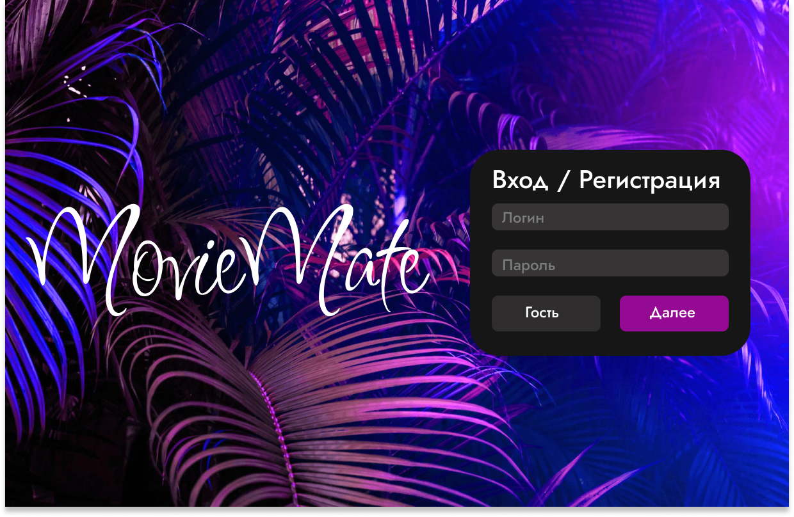

# Требования к проекту «MovieMate»

---

# Содержание

1. [Введение](#intro)  
   1.1 [Назначение](#appointment)  
   1.2 [Бизнес-требования](#business_requirements)  
   1.2.1 [Исходные данные](#initial_data)  
   1.2.2 [Возможности бизнеса](#business_opportunities)  
   1.2.3 [Границы проекта](#project_boundary)  
   1.3 [Аналоги](#analogues)  
2. [Требования пользователя](#user_requirements)  
   2.1 [Программные интерфейсы](#software_interfaces)  
   2.2 [Интерфейс пользователя](#user_interface)  
   2.3 [Характеристики пользователей](#user_specifications)  
   2.3.1 [Классы пользователей](#user_classes)  
   2.3.2 [Аудитория приложения](#application_audience)  
   2.3.2.1 [Целевая аудитория](#target_audience)  
   2.3.2.2 [Побочная аудитория](#collateral_audience)  
   2.4 [Предположения и зависимости](#assumptions_and_dependencies)  
3. [Системные требования](#system_requirements)  
   3.1 [Функциональные требования](#functional_requirements)  
   3.1.1 [Основные функции](#main_functions)  
   3.1.1.1 [Поиск фильмов](#search_movies)  
   3.1.1.2 [Добавление фильма в коллекцию](#add_movie)  
   3.1.1.3 [Удаление фильма из коллекции](#remove_movie)  
   3.1.1.4 [Просмотр коллекции](#view_collection)  
   3.1.1.5 [Рекомендации](#recommendations)  
   3.1.2 [Ограничения и исключения](#restrictions_and_exclusions)  
   3.2 [Нефункциональные требования](#non-functional_requirements)  
   3.2.1 [Атрибуты качества](#quality_attributes)  
   3.2.1.1 [Требования к удобству использования](#requirements_for_ease_of_use)  
   3.2.1.2 [Требования к безопасности](#security_requirements)  
   3.2.1.3 [Требования к производительности](#performance_requirements)  
   3.2.2 [Внешние интерфейсы](#external_interfaces)  
   3.2.3 [Ограничения](#restrictions)  
4. [Мокапы](#mockups)  

---

<a name="intro"/>

# 1 Введение

<a name="appointment"/>

## 1.1 Назначение

В этом документе описаны функциональные и нефункциональные требования к приложению «MovieMate». Оно позволяет пользователям управлять личной коллекцией фильмов, искать фильмы и получать рекомендации на основе их предпочтений.

<a name="business_requirements"/>

## 1.2 Бизнес-требования

<a name="initial_data"/>

### 1.2.1 Исходные данные

Сейчас пользователи ведут списки просмотренных фильмов вручную (например, в заметках). Нет единой удобной системы, где можно управлять коллекцией и получать рекомендации.

<a name="business_opportunities"/>

### 1.2.2 Возможности бизнеса

Приложение позволит пользователям:

* вести личную коллекцию фильмов;
* быстро находить фильмы и просматривать их описание;
* получать рекомендации на основе предпочтений;
* делиться коллекцией с друзьями (в будущем).

<a name="project_boundary"/>

### 1.2.3 Границы проекта

В MVP предусмотрены:

* поиск фильмов;
* добавление и удаление из коллекции;
* просмотр информации о фильме (жанр, рейтинг, описание);
* рекомендации.

Не входят: просмотр фильмов онлайн, социальные функции (лайки, комментарии).

<a name="analogues"/>

## 1.3 Аналоги

* **Кинопоиск** — крупная база фильмов, но перегружен функциями.  
* **Иви** — платформа для просмотра фильмов, основной упор на медиаконтент.  

Наше приложение проще: оно фокусируется на коллекции и рекомендациях.

---

<a name="user_requirements"/>

# 2 Требования пользователя

<a name="software_interfaces"/>

## 2.1 Программные интерфейсы

Приложение использует публичные API (TMDb, IMDb) для загрузки информации о фильмах.

<a name="user_interface"/>

## 2.2 Интерфейс пользователя

Основные окна приложения представлены на мокапах в разделе [4. Мокапы](#mockups).

<a name="user_specifications"/>

## 2.3 Характеристики пользователей

<a name="user_classes"/>

### 2.3.1 Классы пользователей

| Класс пользователей   | Описание                                                     |
| :-------------------- | :----------------------------------------------------------- |
| Гости                 | Могут искать фильмы и просматривать информацию без регистрации |
| Зарегистрированные    | Могут добавлять фильмы в коллекцию и получать рекомендации   |

<a name="application_audience"/>

### 2.3.2 Аудитория приложения

<a name="target_audience"/>

#### 2.3.2.1 Целевая аудитория

Киноманы и обычные зрители, которые хотят вести учёт просмотренных фильмов и получать рекомендации.

<a name="collateral_audience"/>

#### 2.3.2.2 Побочная аудитория

Исследователи кино и студенты, которым нужно удобно собирать коллекции фильмов.

<a name="assumptions_and_dependencies"/>

## 2.4 Предположения и зависимости

1. Доступность публичных API.  
2. Стабильное интернет-соединение.  
3. Совместимость с современными браузерами и мобильными устройствами.  

---

<a name="system_requirements"/>

# 3 Системные требования

<a name="functional_requirements"/>

## 3.1 Функциональные требования

<a name="main_functions"/>

### 3.1.1 Основные функции

<a name="search_movies"/>

#### 3.1.1.1 Поиск фильмов

**Описание.** Пользователь может искать фильмы по названию.  

<a name="add_movie"/>

#### 3.1.1.2 Добавление фильма в коллекцию

**Описание.** Пользователь может добавить фильм в личную коллекцию.  

<a name="remove_movie"/>

#### 3.1.1.3 Удаление фильма из коллекции

**Описание.** Пользователь может удалять фильмы из коллекции.  

<a name="view_collection"/>

#### 3.1.1.4 Просмотр коллекции

**Описание.** Пользователь может просматривать список фильмов в своей коллекции.  

<a name="recommendations"/>

#### 3.1.1.5 Рекомендации

**Описание.** Система должна предлагать пользователю фильмы на основе его коллекции и предпочтений.  

<a name="restrictions_and_exclusions"/>

### 3.1.2 Ограничения и исключения

* Нет возможности смотреть фильмы онлайн.  
* Социальные функции (лайки, комментарии) будут добавлены позже.  

---

<a name="non-functional_requirements"/>

## 3.2 Нефункциональные требования

<a name="quality_attributes"/>

### 3.2.1 Атрибуты качества

<a name="requirements_for_ease_of_use"/>

#### 3.2.1.1 Требования к удобству использования

1. Интерфейс должен быть простым и интуитивным.  
2. Все ключевые действия доступны максимум за 2–3 клика.  

<a name="security_requirements"/>

#### 3.2.1.2 Требования к безопасности

1. Авторизация с использованием JWT или OAuth.  
2. Защита от XSS и CSRF атак.  

<a name="performance_requirements"/>

#### 3.2.1.3 Требования к производительности

1. Поиск должен выполняться ≤ 2 секунд.  
2. Приложение должно работать стабильно при большом числе фильмов в коллекции.  

<a name="external_interfaces"/>

### 3.2.2 Внешние интерфейсы

UI выполнен в стиле минимализма с упором на коллекцию фильмов и рекомендации.  

<a name="restrictions"/>

### 3.2.3 Ограничения

1. Реализация — Web/Mobile приложение.  
2. Языки разработки: Python (backend), JavaScript/TypeScript (frontend).  
3. Использование базы данных для хранения коллекций.  

---

<a name="mockups"/>

# 4 Мокапы

### 4.1 Вход / Регистрация

### 4.2 Моя коллекция

### 4.3 Карточка фильма

### 4.4 Рекомендации

### 4.5 Окошко фильма

### 4.6 Макет карточки фильма

