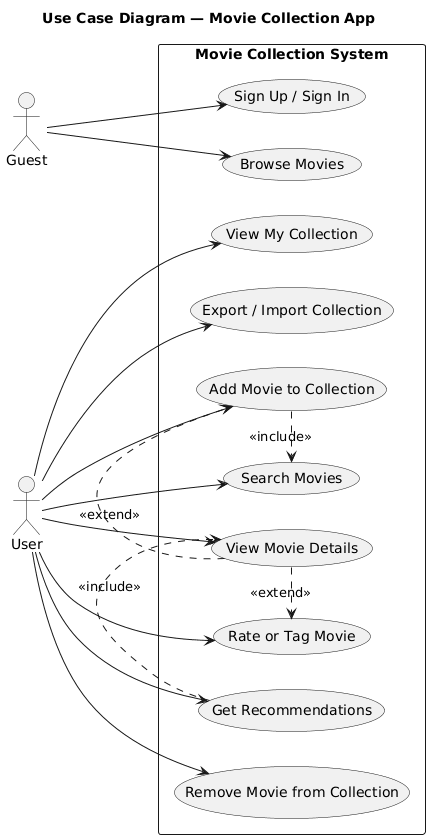

# 🎬 UML Overview — Movie Collection App

**Лабораторные работы №3–4**  
по дисциплине *«Объектно-ориентированное проектирование систем. Язык UML»*

---

## 📖 Краткое описание системы

**Система:** веб/мобильное приложение для управления личной коллекцией фильмов, поиска и получения рекомендаций.  
**Цель:** позволить пользователю вести собственную коллекцию фильмов, оценивать, сортировать, получать рекомендации на основе предпочтений и искать новые фильмы.

---

## 📘 Глоссарий и сценарии

| Файл | Назначение |
|------|-------------|
| [`glossary.md`](glossary.md) | Словарь ключевых терминов проекта (User, Movie, Collection, Recommendation, API и др.) |
| [`flows/add_movie.md`](flows/add_movie.md) | Сценарий добавления фильма в коллекцию |
| [`flows/get_recs.md`](flows/get_recs.md) | Сценарий получения рекомендаций |
| [`flows/view_movie.md`](flows/view_movie.md) | Сценарий просмотра карточки фильма |

---

## ⚙️ UML Диаграммы

Ниже приведены все диаграммы, созданные в рамках лабораторных работ №3–4, с краткими пояснениями.

---

### 1️⃣ **Диаграмма вариантов использования (Use Case Diagram)**  
Отражает функциональные возможности системы и роли пользователей.

#### ⚫ Use Case — функциональные сценарии

**Описание:**  
- **Актёры:**  
  - `Guest` — неавторизованный пользователь, может просматривать фильмы и авторизоваться.  
  - `User` — авторизованный пользователь, управляющий своей коллекцией.  
- **Основные варианты использования:** регистрация, поиск, просмотр, добавление, оценка, рекомендации, экспорт/импорт.  
- Используются связи `<<include>>` и `<<extend>>` для отображения зависимостей между сценариями.  

---

### 2️⃣ **Диаграммы активностей (Activity Diagrams)**  
Показывают пошаговое выполнение ключевых сценариев приложения.

#### 🟢 Получение рекомендаций  
  
Пользователь открывает вкладку «Рекомендации».  
Система анализирует предпочтения, обращается к Recommendation Service и показывает подборку фильмов.

#### 🟢 Добавление фильма в коллекцию  
  
Пользователь выполняет поиск фильма, открывает карточку и добавляет его в коллекцию.  
Ветвления учитывают ошибки сети и дубликаты.

#### 🟢 Просмотр карточки фильма  
  
Пользователь просматривает карточку фильма, может добавить его, оценить или посмотреть похожие фильмы.

---

### 3️⃣ **Диаграммы последовательностей (Sequence Diagrams)**  
Отображают взаимодействие между объектами системы во времени.

#### 🔵 Добавление фильма в коллекцию  
  
UI → Controller → Repository → Database → API.  
Система проверяет наличие фильма, добавляет в коллекцию и подтверждает добавление.

#### 🔵 Получение рекомендаций  
  
UI запрашивает рекомендации у контроллера.  
Контроллер обращается к профилю предпочтений, RecommendationService и внешнему API фильмов.

#### 🔵 Просмотр карточки фильма  
  
UI получает данные фильма от API, отображает карточку и позволяет добавить или оценить фильм.

---

### 4️⃣ **Диаграмма состояний (State Diagram)**  
Показывает жизненный цикл карточки фильма и возможные состояния интерфейса.

#### 🟣 Карточка фильма  
  
Состояния: *не загружена → загружается → загружена → добавлена → просмотрена → оценена → удалена*.  
Переходы зависят от действий пользователя и ответов системы.

---

### 5️⃣ **Диаграмма классов (Class Diagram)**  
Отображает структуру и связи объектов системы.

#### 🟠 Доменная модель  
  
Основные классы:  
`User`, `PreferencesProfile`, `Collection`, `Movie`, `RecommendationService`, `SearchService`, `AuthService`, `MovieRepository`.  
Показаны поля, методы и ассоциации между ними.

---

### 6️⃣ **Диаграмма компонентов (Component Diagram)**  
Показывает архитектуру приложения и взаимодействие между модулями.

#### 🟡 Архитектура компонентов  
  
- **Client Side:** Web UI, Mobile App  
- **Backend API:** контроллеры и сервисы (Auth, Movie, Recommendation, Search)  
- **Data Sources:** Database, External Movie API  
Показано, как пользователь взаимодействует с системой через REST API и как сервер обращается к хранилищу и внешним сервисам.

---

### 7️⃣ **Диаграмма развёртывания (Deployment Diagram)**  
Показывает, как программные компоненты размещаются на физических узлах.

#### ⚫ Развёртывание системы  
  
- **User Device:** Web Browser, Mobile App  
- **Application Server:** Backend API, Auth, Movie, Recommendation, Search  
- **Database Server:** PostgreSQL / SQLite  
- **External API:** TMDb / OMDb  
Связи: HTTPS, SQL — отражают реальные каналы взаимодействия.

---

## ✅ Итог выполнения лабораторных №3–4

| Этап | Артефакт | Файл | Статус |
|------|-----------|------|--------|
| 1 | Глоссарий | `glossary.md` | ✅ |
| 2 | Диаграмма классов (первичная модель) | `class_domain.png` | ✅ |
| 3 | Use Case + актёры | `usecase_main.png` | ✅ |
| 4 | Flow of Events (подробные сценарии) | `add_movie.md`, `get_recs.md`, `view_movie.md` | ✅ |
| 5 | Диаграммы активностей | `activity_*.png` | ✅ |
| 6 | Диаграммы последовательностей | `sequence_*.png` | ✅ |
| 7 | Диаграмма состояний | `state_movie_card.png` | ✅ |
| 8 | Уточнённая диаграмма классов | `class_domain.png` | ✅ |
| 9 | Диаграмма компонентов | `component_arch.png` | ✅ |
| 10 | Диаграмма развёртывания | `deployment_arch.png` | ✅ |
| 11–13 | Структура, оформление, хранение в GitHub | `/docs/` | ✅ |

---

## 🧾 Вывод

В ходе лабораторных работ №3–4:
- Изучены основы объектно-ориентированного проектирования и язык UML.  
- Разработан глоссарий и спецификация предметной области.  
- Спроектированы все ключевые виды UML-диаграмм: Use Case, Activity, Sequence, State, Class, Component, Deployment.  
- Построена полная архитектурная модель веб/мобильного приложения для управления коллекцией фильмов.  
- Получен практический навык применения UML для проектирования систем от уровня требований до архитектуры.

---

**Все 13 пунктов лабораторной работы выполнены полностью.** ✅  
