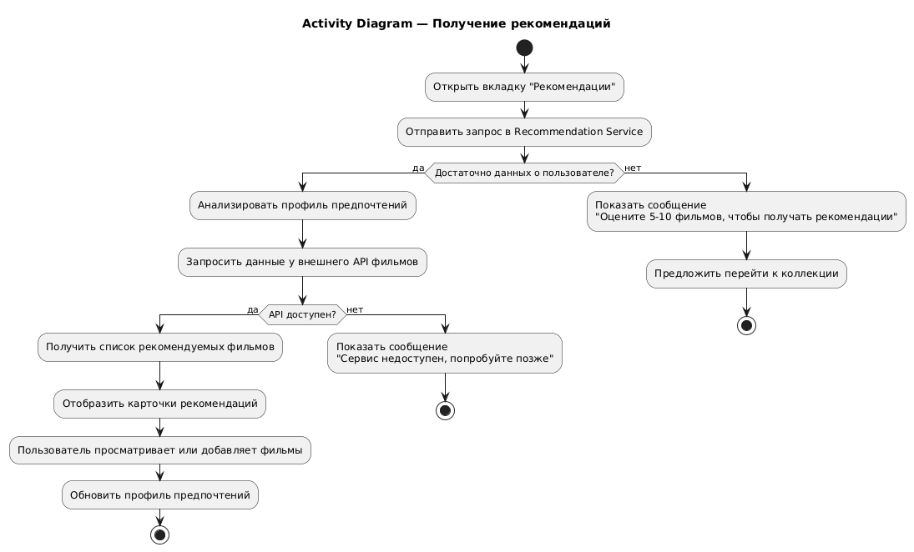
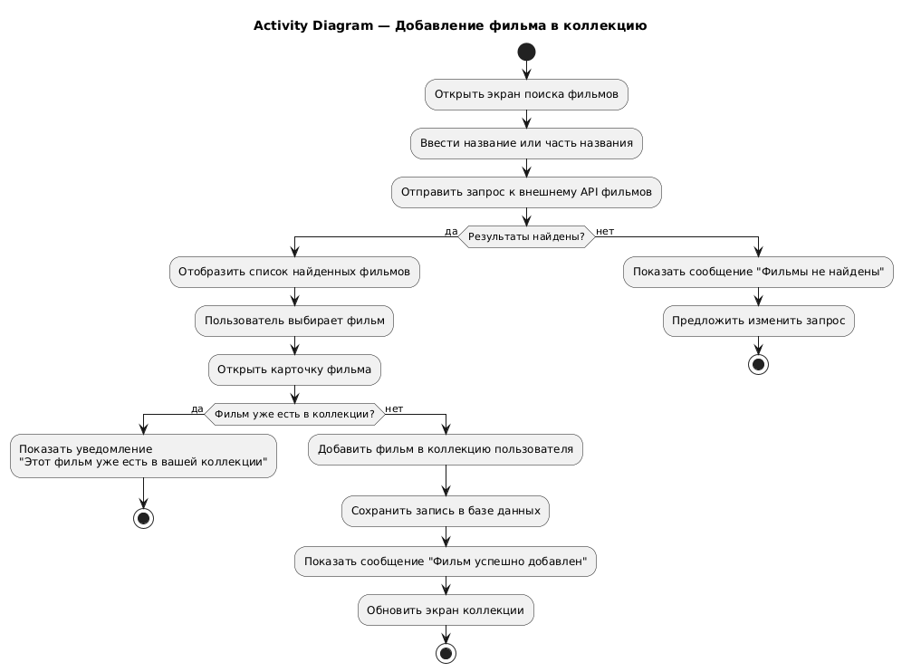
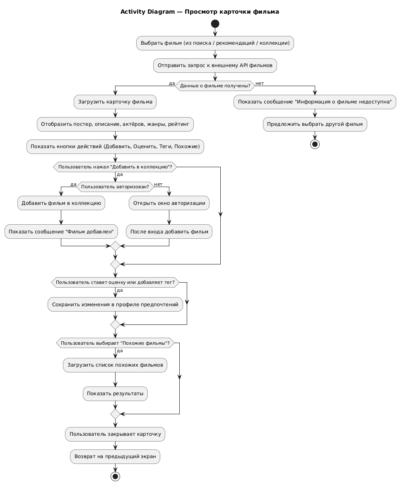
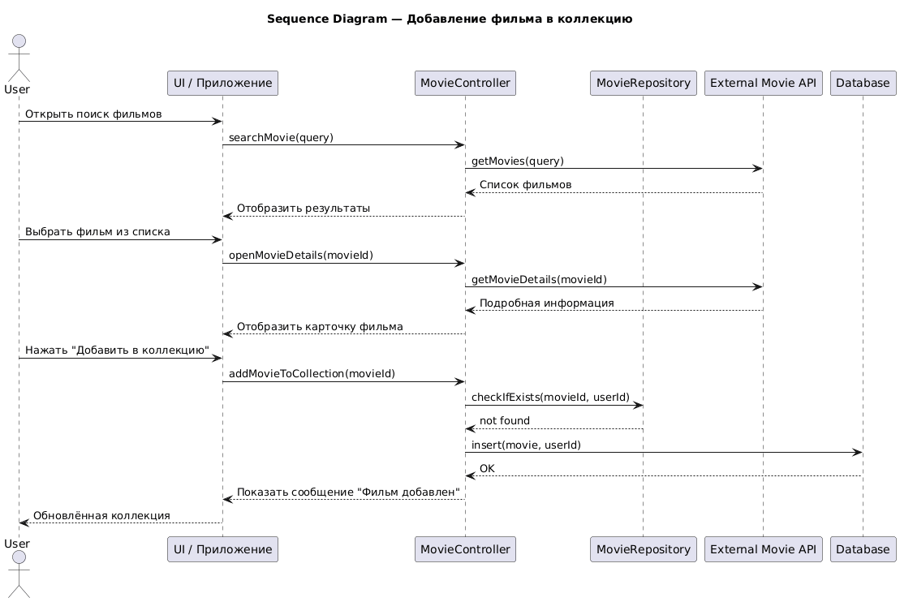
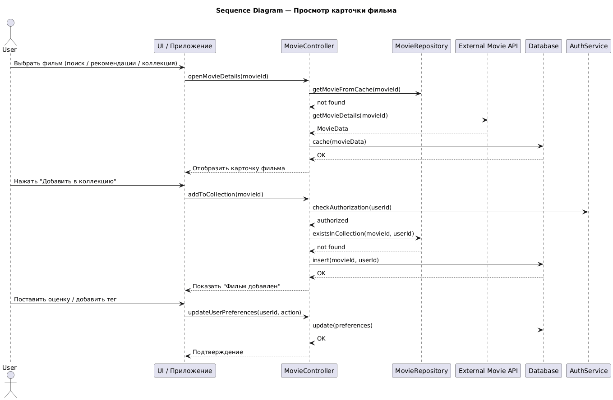
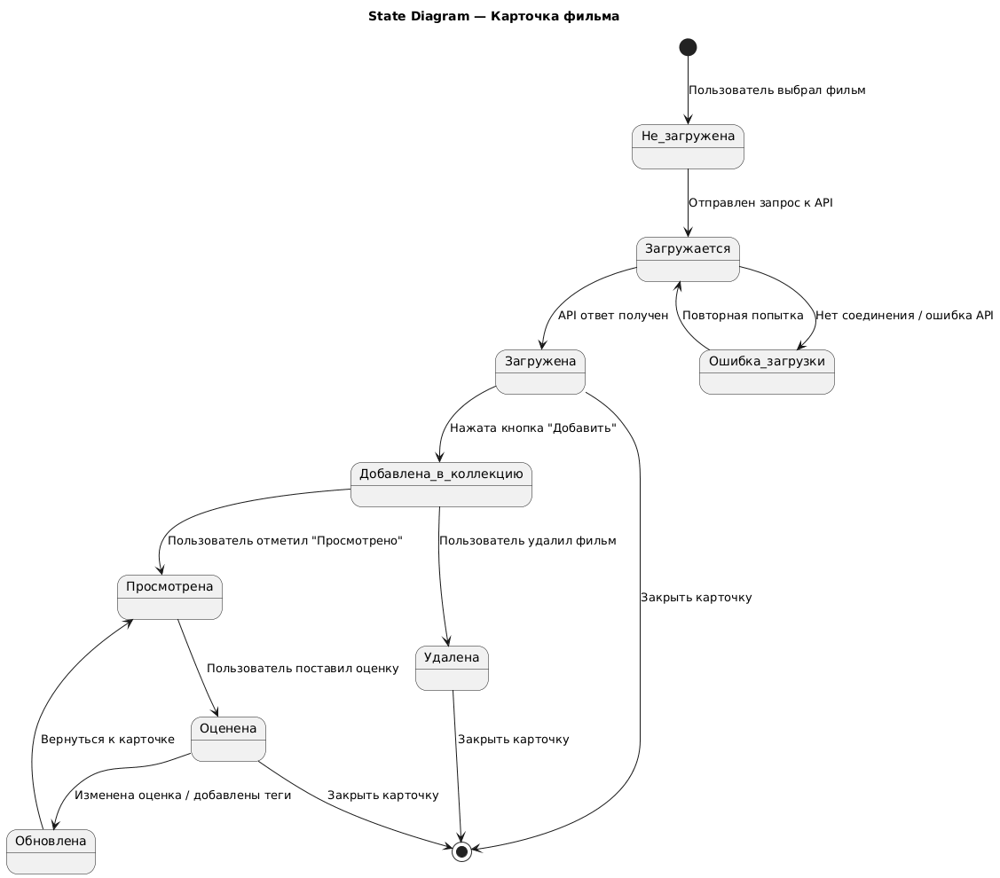
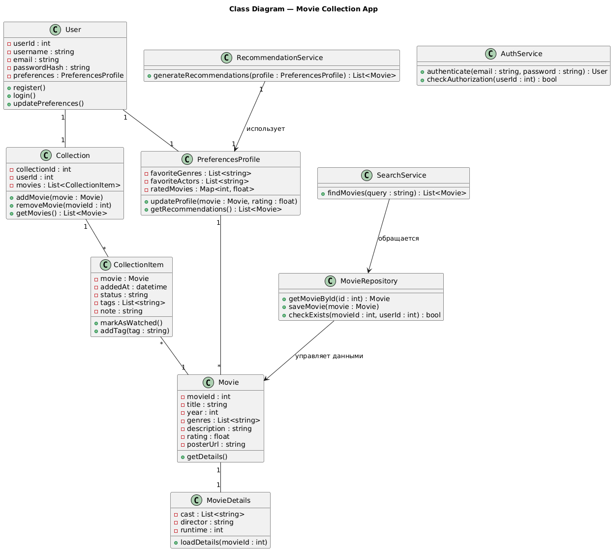
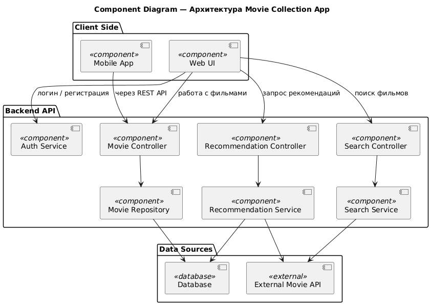
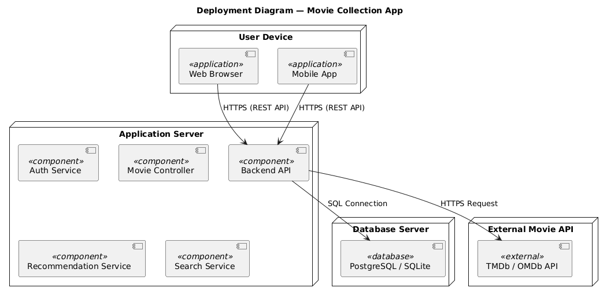

# 🎬 UML Overview — Movie Collection App

**Лабораторные работы №3–4**  
по дисциплине *«Объектно-ориентированное проектирование систем. Язык UML»*  

---

## 📖 Краткое описание системы

**Система:** веб/мобильное приложение для управления личной коллекцией фильмов, поиска и получения рекомендаций.  
Пользователь может:
- добавлять фильмы в коллекцию;
- просматривать карточки фильмов;
- получать рекомендации на основе своих оценок и предпочтений.

---

## 📘 Глоссарий и сценарии

| Файл | Назначение |
|------|-------------|
| [`glossary.md`](glossary.md) | Словарь ключевых терминов проекта (User, Movie, Collection, Recommendation, API и т.д.) |
| [`flows/add_movie.md`](flows/add_movie.md) | Сценарий добавления фильма в коллекцию |
| [`flows/get_recs.md`](flows/get_recs.md) | Сценарий получения рекомендаций |
| [`flows/view_movie.md`](flows/view_movie.md) | Сценарий просмотра карточки фильма |

---

## ⚙️ UML Диаграммы

Ниже приведены все диаграммы, созданные в рамках лабораторных работ №3–4.

---

### 1️⃣ **Диаграммы активностей (Activity Diagrams)**
Показывают пошаговый ход выполнения ключевых сценариев.

#### 🟢 Получение рекомендаций  
  
**Описание:** пользователь открывает вкладку «Рекомендации», система анализирует предпочтения, запрашивает данные у Recommendation Service и отображает подборку фильмов.

#### 🟢 Добавление фильма в коллекцию  
  
**Описание:** пользователь ищет фильм, открывает карточку и добавляет его в коллекцию.  
Есть ветвления: фильм не найден, уже добавлен, ошибка сети.

#### 🟢 Просмотр карточки фильма  
  
**Описание:** пользователь открывает карточку фильма, может добавить его в коллекцию, поставить оценку, просмотреть похожие фильмы.  
Отражены проверки авторизации и ошибок загрузки.

---

### 2️⃣ **Диаграммы последовательностей (Sequence Diagrams)**
Показывают взаимодействие между объектами и сервисами во времени.

#### 🔵 Добавление фильма в коллекцию  
  
**Описание:** пользователь → UI → контроллер → репозиторий → база данных.  
Система проверяет наличие фильма, добавляет его и возвращает подтверждение.

#### 🔵 Получение рекомендаций  
  
**Описание:** UI запрашивает рекомендации у контроллера,  
тот обращается к профилю предпочтений, RecommendationService и внешнему API фильмов.

#### 🔵 Просмотр карточки фильма  
  
**Описание:** пользователь выбирает фильм, система получает детали из API,  
отображает карточку и позволяет добавить фильм или поставить оценку.

---

### 3️⃣ **Диаграмма состояний (State Diagram)**
Отражает жизненный цикл карточки фильма.

#### 🟣 Карточка фильма  
  
**Описание:** состояния — «не загружена», «загружается», «загружена»,  
«добавлена в коллекцию», «просмотрена», «оценена», «удалена».  
Показаны переходы между состояниями при действиях пользователя.

---

### 4️⃣ **Диаграмма классов (Class Diagram)**
Показывает структуру объектов и их взаимосвязи.

#### 🟠 Доменная модель  
  
**Описание:** классы `User`, `Movie`, `Collection`, `RecommendationService`, `SearchService`, `AuthService` и т.д.  
Показаны атрибуты, методы и связи между ними (ассоциации и зависимости).

---

### 5️⃣ **Диаграмма компонентов (Component Diagram)**
Показывает архитектурное деление системы.

#### 🟡 Архитектура компонентов  
  
**Описание:**  
- **Client Side:** Web UI, Mobile App  
- **Backend API:** контроллеры и сервисы (Auth, Movie, Recommendation, Search)  
- **Data Sources:** база данных и внешний API фильмов  
Стрелки показывают взаимодействие компонентов и потоки данных.

---

### 6️⃣ **Диаграмма развёртывания (Deployment Diagram)**
Отображает физическое размещение компонентов.

#### ⚫ Развёртывание системы  
  
**Описание:**  
- **User Device:** Web Browser, Mobile App  
- **Application Server:** Backend API, сервисы и контроллеры  
- **Database Server:** база данных PostgreSQL/SQLite  
- **External API:** TMDb/OMDb  
Показаны связи (HTTPS, SQL) и архитектура развертывания системы.

---

## ✅ Итог

Создан полный комплект UML-диаграмм, отражающий все этапы объектно-ориентированного проектирования:

| Тип диаграммы | Название файла | Статус |
|----------------|----------------|--------|
| Use Case | *(см. сценарии Flow of Events)* | ✅ |
| Activity | `activity_*.png` | ✅ |
| Sequence | `sequence_*.png` | ✅ |
| State | `state_movie_card.png` | ✅ |
| Class | `class_domain.png` | ✅ |
| Component | `component_arch.png` | ✅ |
| Deployment | `deployment_arch.png` | ✅ |

---

**Все пункты лабораторных №3–4 выполнены.**  
Проект включает анализ требований, сценарии, модель предметной области и полный набор UML-диаграмм от поведения до физического развёртывания.

---
